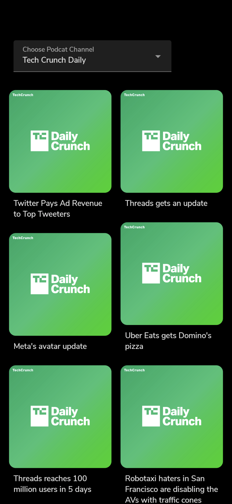
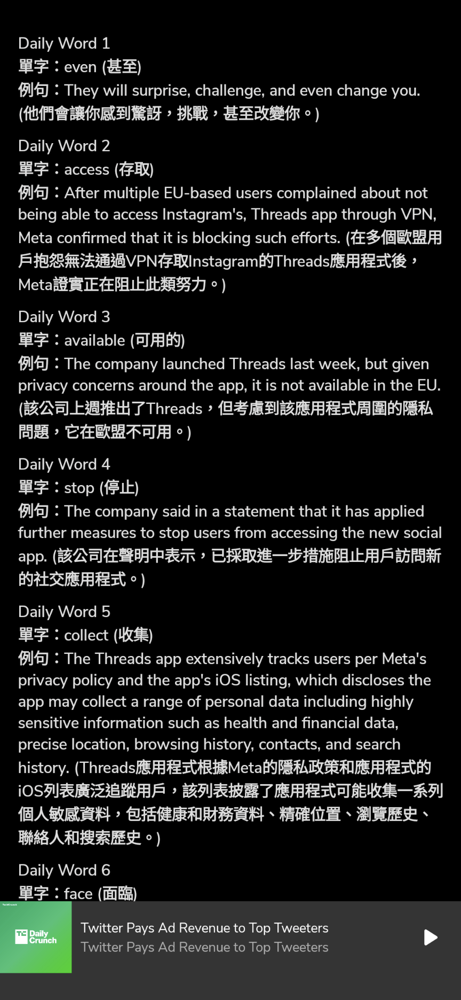

#  Podcast To Learn 

 Creating a podcast player for helping people **learn language by listening daily news** with AI powered **Large Language Models service**.

This is a podcast app fork from Fabirt's [Podcast App](https://github.com/fabirt/podcast-app).

The origin App is just a normal podcast player app made with Jetpack Compose and ExoPlayer. 

## Product Features

- Daily News Episode List
- Play Podcast
- Live Captions
- News Quiz
- Daily Words

I made some adjustments to the podcast sources in the original project, keeping only TechCrunch Daily News and Public Television Evening News as the target news channels. 

First, I used the Whisper API to transcribe the daily news audio into text transcripts and obtained the news articles. 

Then I passed them to the Chat API to automatically extract daily vocabulary words and example sentences from the articles.

In addition, I also had the Chat API split the news articles into several paragraphs by topics. 

Finally, based on these paragraphs, it generated multiple choice comprehension questions to test the listeners' understanding of the articles.

## Project Features

The following Features and infrastructure were already completed in the original Podcast Player App:

- Jetpack Compose UI. Custom animations, transitions, light/dark theme, and layouts.
- Jetpack Compose Navigation.
- Dependency injection with Hilt.
- MVVM Architecture.
- Retrieves podcasts metadata from the network.
- Allows background playback using a foreground service.
- Media style notifications.
- Uses a `MediaBrowserService` to control and expose the current media session.
- Controls the current playback state with actions such as: play/pause, skip to next/previous, shuffle, repeat and stop.
- Supports offline playback using `CacheDataSource` from `ExoPlayer`.
- Process images to find its color palette using Palette API.

The following features were additionally implemented by me to complete the Podcast To Learn App:

- Parse target podcast channel from RSS feeds with RSSReader library. 
- Add Jetpack Room for create a database to store news articles, paragraph, daily words, quiz etc...
- Add `OpenAiService` to communicate with OpenAI audio transcriptions service and chat completions service.
- Create `PodcastCaptionsScreen` for show the daily news captions with live captions.
- Create `QuizScreen` to test whether users have correctly understood the matters conveyed in the news paragraph.
- Create `DailyWordScreen` to list out the Oxford 5000 Key Words whitch are mentioned in the daily news.

## Libraries

Original Podcast Player App:

- Jetpack Compose
- ExoPlayer
- Glide
- Hilt
- Retrofit
- Navigation
- ViewModel
- DataStore
- Palette API

Podcast To Learn App:
  
- Jetpack Room
- KtRssReader
- Hilt Navigation Compose
- Constraintlayout Compose
- Some unit test library to check database work.

### Entity Relationship Diagrams

## Result

### Podcast To Learn App
|  |  | | |
|----------|:-------------:|:-------------:|:-------------:|

### Demo

Podcast To Learn App

